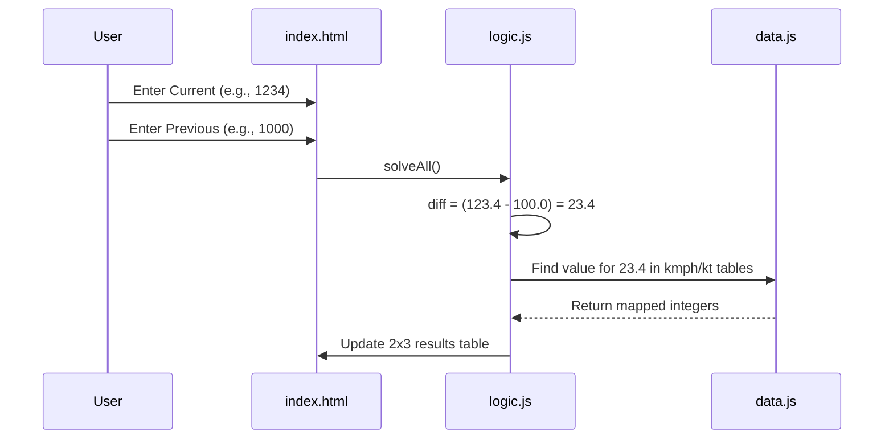

# Wind Section Implementation Plan

The goal is to add a 'Wind Section' to the MET app that calculates average wind speed in kmph and knots across three time intervals based on two anemometer readings.

## 1. UI Changes ([`index.html`](index.html))
- Add a new `section-container` for 'Wind Section'.
- Two input fields:
    - `windCurrent`: Current Anemometer Reading
    - `windPrevious`: Previous Anemometer Reading
- A results card with a 2x3 grid to display:
    - 0830 to 1730 (kmph) | 1730 to 0830 (kmph) | 0830 to 0830 (kmph)
    - 0830 to 1730 (kt)   | 1730 to 0830 (kt)   | 0830 to 0830 (kt)

## 2. Logic Implementation ([`logic.js`](logic.js))
- **Input Handling**: The last digit is treated as a decimal. 
    - Example: User enters `1234` -> Value used is `123.4`.
- **Calculation**: 
    - `difference = current - previous`.
    - Handle potential rollover if the anemometer has a limit (e.g., if current < previous).
- **Table Lookup**:
    - Use the extracted data from [`data.js`](data.js) to find the "Average wind speed" corresponding to the calculated difference for each of the three time columns.

## 3. Data Extraction ([`data.js`](data.js))
- Extract data from `res/wind kmph.JPG` and `res/wind kt.JPG`.
- Structure:
    ```javascript
    const windKmphTable = [
        { range0817: [0.0, 4.4], range1708: [0.0, 7.4], range0808: [0.0, 11.9], value: 0 },
        // ...
    ];
    ```

## 4. Styling ([`style.css`](style.css))
- Create a CSS grid for the 2x3 output table to ensure it fits well on mobile devices.

## 5. Sequence Diagram


## 6. Next Steps
1. Switch to **Code** mode.
2. Update [`data.js`](data.js) with extracted table values.
3. Update [`index.html`](index.html) with new inputs and result container.
4. Update [`style.css`](style.css) for the grid layout.
5. Implement `solveWind()` in [`logic.js`](logic.js).
